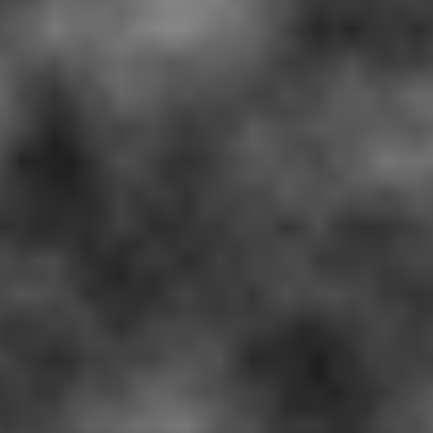

# Value-Noise
Both direct Java (in Processing) and shader generation of landscape/cloud textures using value noise

The file "basicValueNoiseShader.pde" contains the GLSL necessary to run from Processing.

Example landscape generation:
https://youtu.be/JoQl_F_LYN0

</img>
